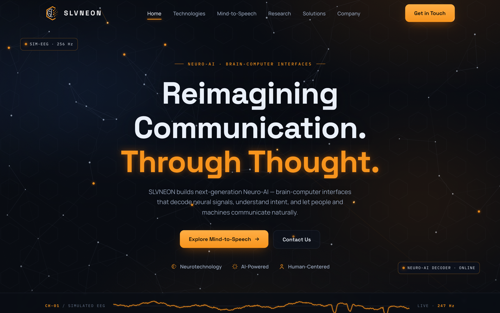
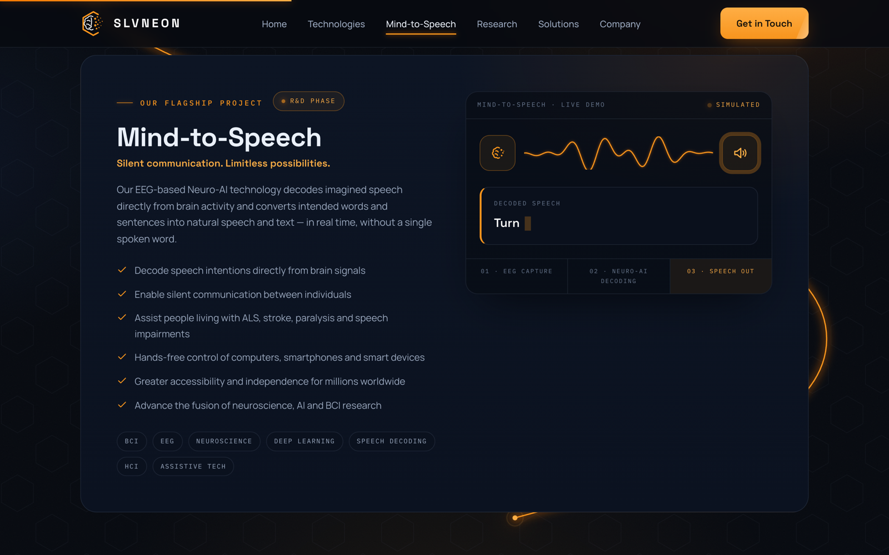
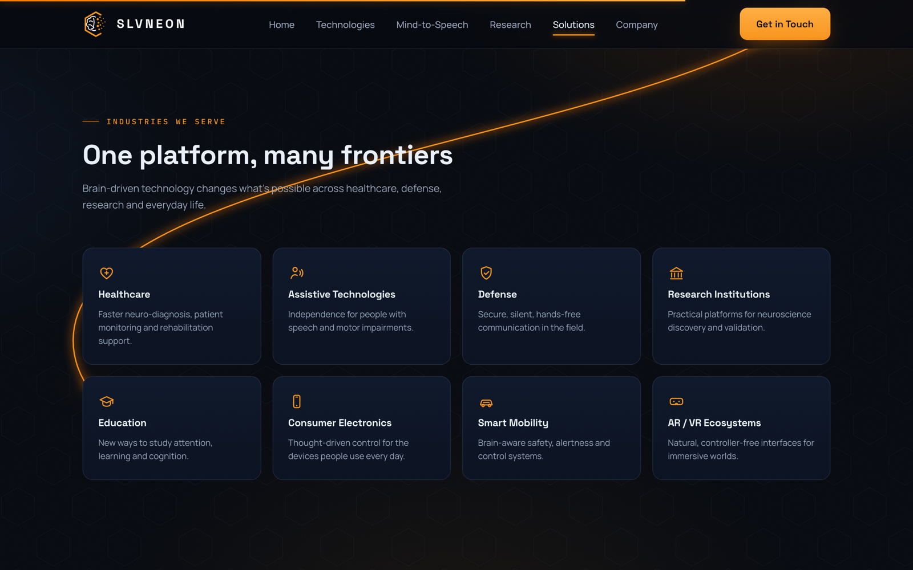

<div align="center">

# ⬡ SLVNEON — Neuro-AI Landing Page

**Reimagining Communication. Through Thought.**

Next-generation landing page for SLVNEON Technologies Pvt. Ltd. — a Brain-Computer
Interface (BCI) company decoding neural signals into natural speech and text.

[](https://nextjs.org)
[](https://react.dev)
[](https://www.typescriptlang.org)
[](#-design-system)

<br />



</div>

---

## ✨ Highlights

Everything is hand-built — no UI framework, no animation library. Just canvas, CSS and React.

- ⚡ **Electrified custom cursor** — glowing core + charge ring, spark trail on movement, crackle arcs over interactive elements, burst on click
- 🧠 **Full-bleed neural synapse field** — mouse-reactive node network with travelling pulses behind the hero
- 🛰️ **Neural-link boot sequence** preloader (skipped on repeat visits)
- 🔡 **Headline "decode" scramble** — characters resolve left-to-right like a decoder, with zero layout shift
- 📈 **Simulated EEG readout** — live canvas instrument strip
- 🗣️ **Mind-to-Speech decoder demo** — animated signal → text → speech flow
- 🔌 **Scroll-following signal trace** — a glowing SVG path that draws itself down the page as you scroll, with a charge node riding the tip
- 🔦 **Mouse-following spotlight** on cards, magnetic buttons, count-up stats, drag-to-scroll pipeline
- ♿ **Accessible by default** — keyboard-friendly, semantic markup, honors `prefers-reduced-motion` (cursor & animations gracefully disable)

## 📸 Screens

| Mind-to-Speech flagship | Industries + signal trace |
| :--: | :--: |
|  |  |

## 🚀 Quick Start

```bash
# install
npm install

# develop
npm run dev        # → http://localhost:3000

# ship
npm run build
npm start
```

> Requires Node.js 18.17+ (Next.js 14 requirement).

## 🧱 Tech Stack

| Layer | Choice | Why |
| --- | --- | --- |
| Framework | **Next.js 14** (App Router) | SSR-rendered content, SEO-safe animations |
| Language | **TypeScript** | strict, zero-`any` components |
| Styling | **Pure CSS** design system | navy / orange hexagonal identity, design tokens in `:root` |
| Visuals | **Canvas 2D + SVG** | synapse field, EEG strip, decoder wave, cursor, scroll trace |
| Fonts | Space Grotesk · Manrope · IBM Plex Mono | display / body / telemetry |

## 📁 Structure

```
app/
├─ layout.tsx          # shell: preloader, cursor, scroll trace, progress bar
├─ page.tsx            # section composition
└─ globals.css         # the entire design system

components/
├─ Hero.tsx            # full-viewport hero
├─ NeuralField.tsx     # mouse-reactive synapse canvas
├─ ElectricCursor.tsx  # custom cursor + card spotlight
├─ ScrollPath.tsx      # scroll-following signal trace
├─ DecodeText.tsx      # layout-stable scramble text
├─ EEGStrip.tsx        # simulated EEG instrument
├─ DecoderDemo.tsx     # Mind-to-Speech live demo
└─ …                   # Pipeline, Industries, Pillars, Stats, CTA, Footer
```

## 🎨 Design System

The identity is **navy & ember-orange with a hexagonal motif**, defined entirely by CSS
custom properties in [`app/globals.css`](app/globals.css):

```css
--bg: #06090f;       /* deep navy */
--orange: #f7941d;   /* signal orange */
--ember: #ff7a00;    /* charge glow */
--hex: polygon(50% 0%, 100% 25%, 100% 75%, 50% 100%, 0% 75%, 0% 25%);
```

Every glow, pulse and arc derives from this palette — the "electricity" is an effect
layer, not a color change.

## ♿ Motion & Accessibility

- All animations respect `prefers-reduced-motion` — the cursor, scramble, EEG and
  scroll trace render static fallbacks
- The custom cursor only activates for fine pointers (mouse/trackpad), never touch
- Headline scramble reserves its final layout up front → **CLS ≈ 0**
- Content is server-rendered; animations are progressive enhancement

---

<div align="center">
<sub>© SLVNEON Technologies Pvt. Ltd. — built with Next.js, canvas and a lot of ⚡</sub>
</div>
